# Happy Cloud Platform Server

<!-- prettier-ignore-start -->


## 해피 클라우드 플랫폼 

Happy Cloud Platform은 Kubernetes 기반 클라우드 구조 모사 시스템

헥사고날 아키텍처 기반으로 Kubernetes 를 활용하여 Compute 및 Network 개념을 추상화하고 , 클라우드 서비스 동작 구조를 구현함

실제로는 Compute Server는 VM 으로 할당하고, Network 는 L2,L3 단에서 처리해야 하지만, 

본 프로젝트에서는 k8s 를 활용하여 최대한 클라우드 서비스를 흉내내는 것을 목표


### System Requirements

- [java] 21
- [springboot] 3.5.8
- [springcloud] 2025.0.1
- [mysql] 8.0.33
- [redis] 6.2.10
- [k8s] v1.35.1
- [kafka] 4.1.1


### Architecture

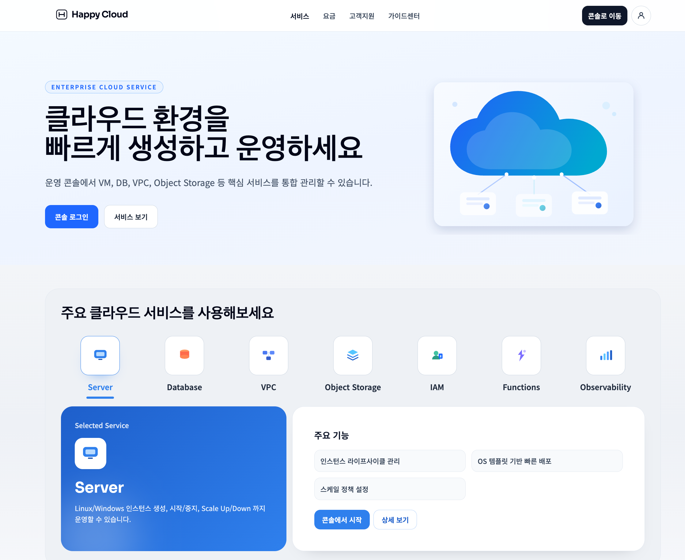


### 핵심 기능

✔ 로그인 인증 / 인가

* 아키텍처

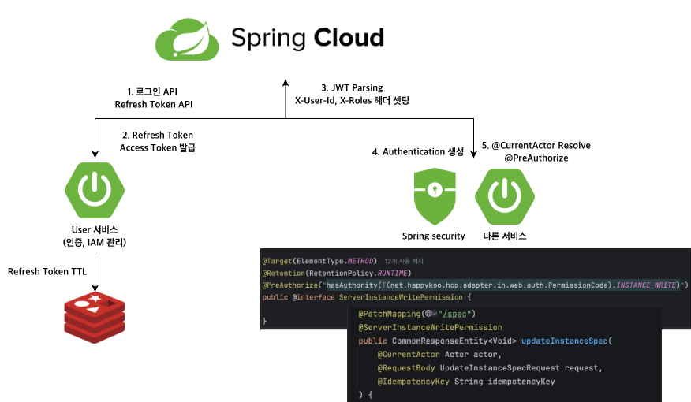

* 관련 UI

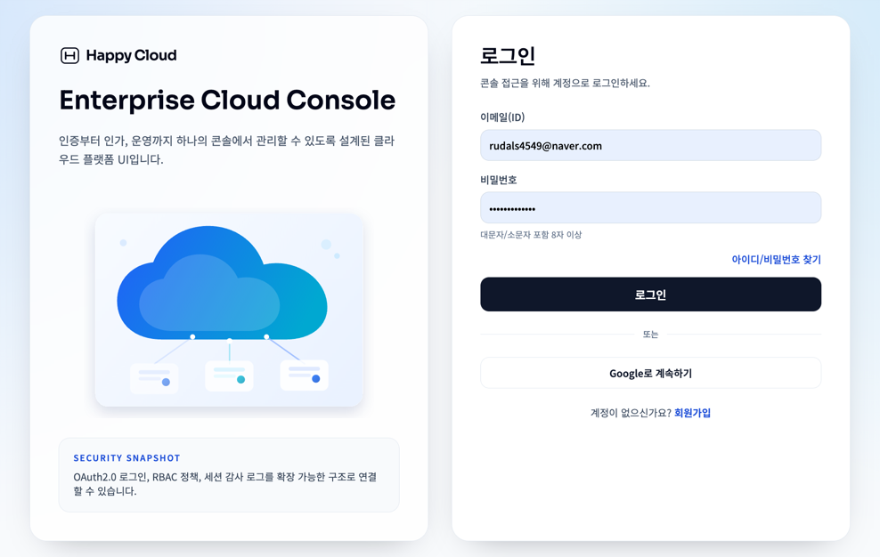

✔ 인스턴스 작업 및 상태 동기화 기본 메커니즘

* 아키텍처

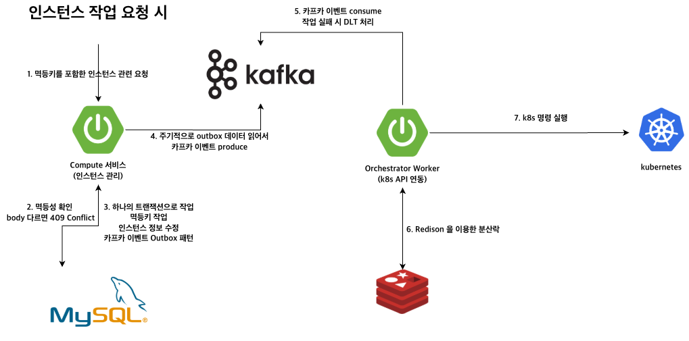

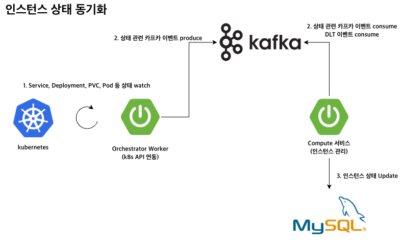


✔  인스턴스 생성

* 아키텍처

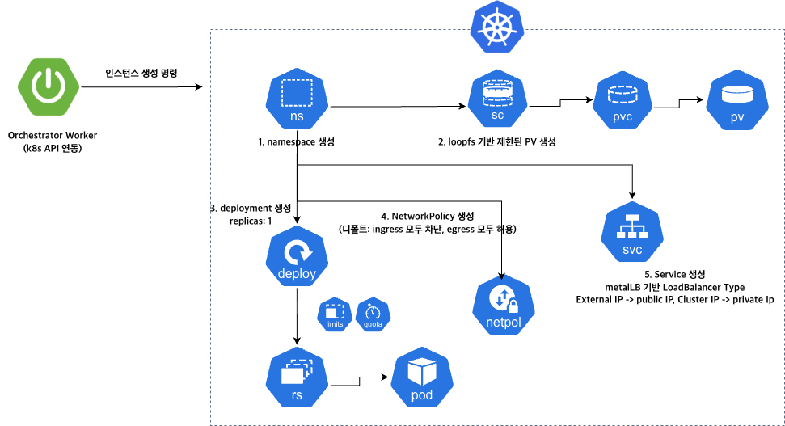

* 관련 UI

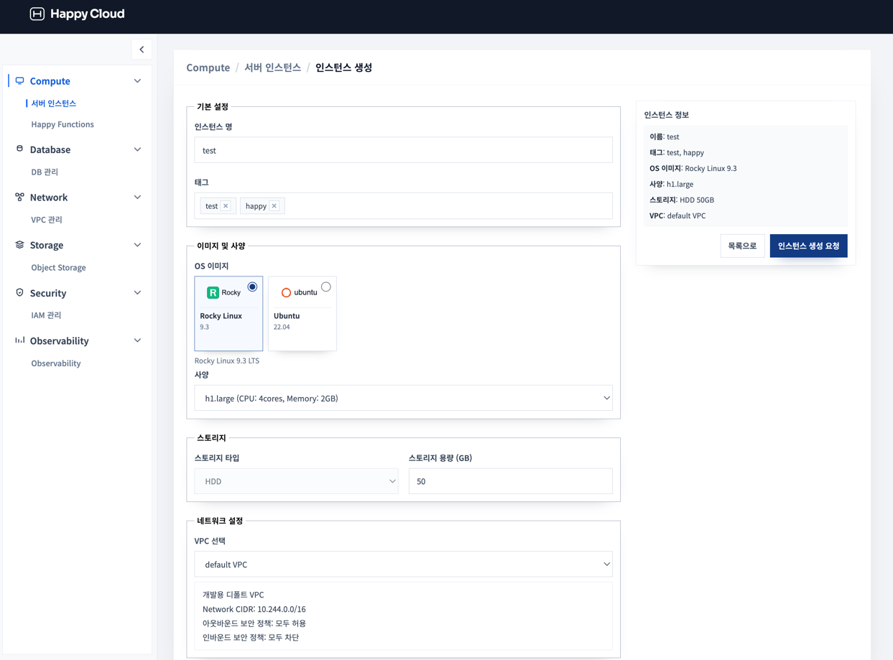


✔  인스턴스 중지

* 아키텍처

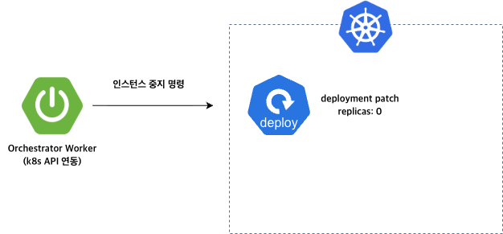


✔  인스턴스 재시작

* 아키텍처


✔  인스턴스 삭제

* 아키텍처

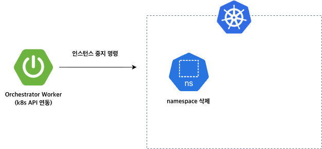

* 관련 UI

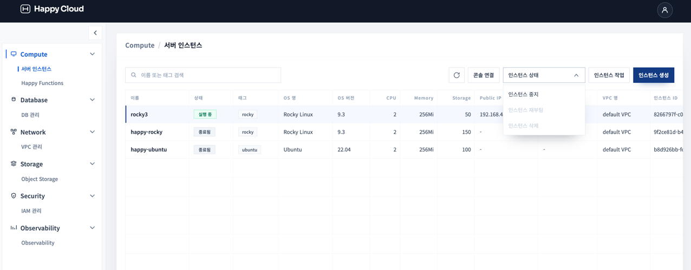


✔ Scale up / down

* 아키텍처

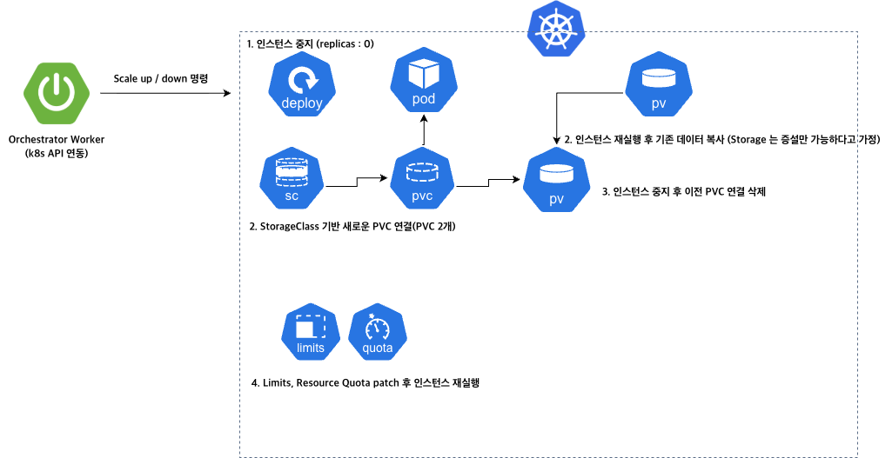


✔ 보안 그룹 관리

* 아키텍처

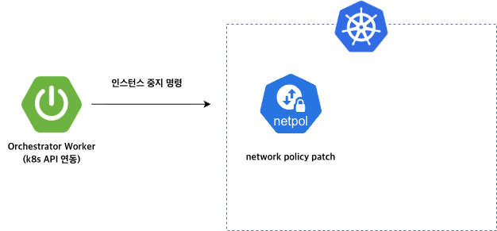


* 관련 UI

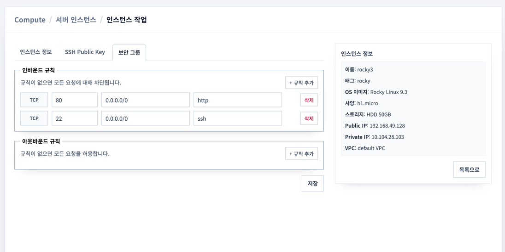


✔ SSH key 등록 / SSH 접근

* 아키텍처

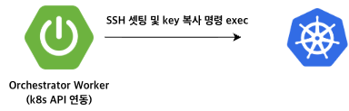

* 관련 UI

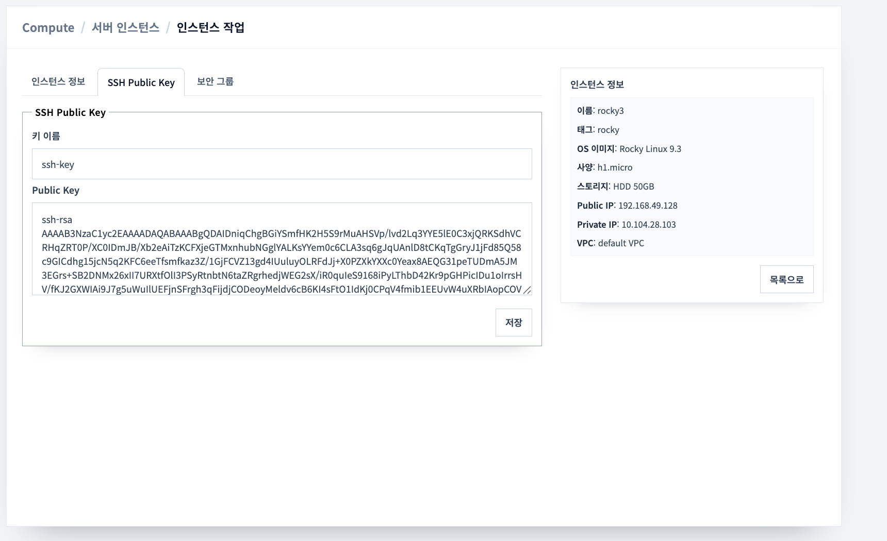

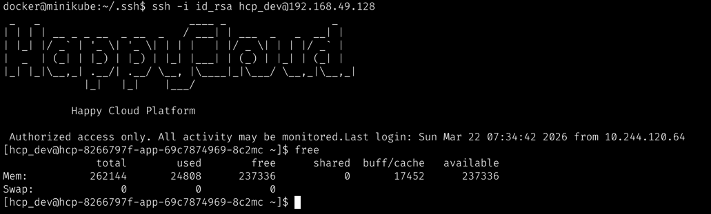


✔ 웹 콘솔 연결

* 아키텍처

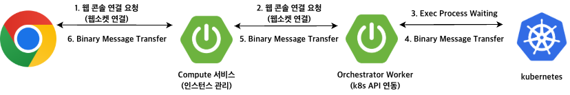

* 관련 UI

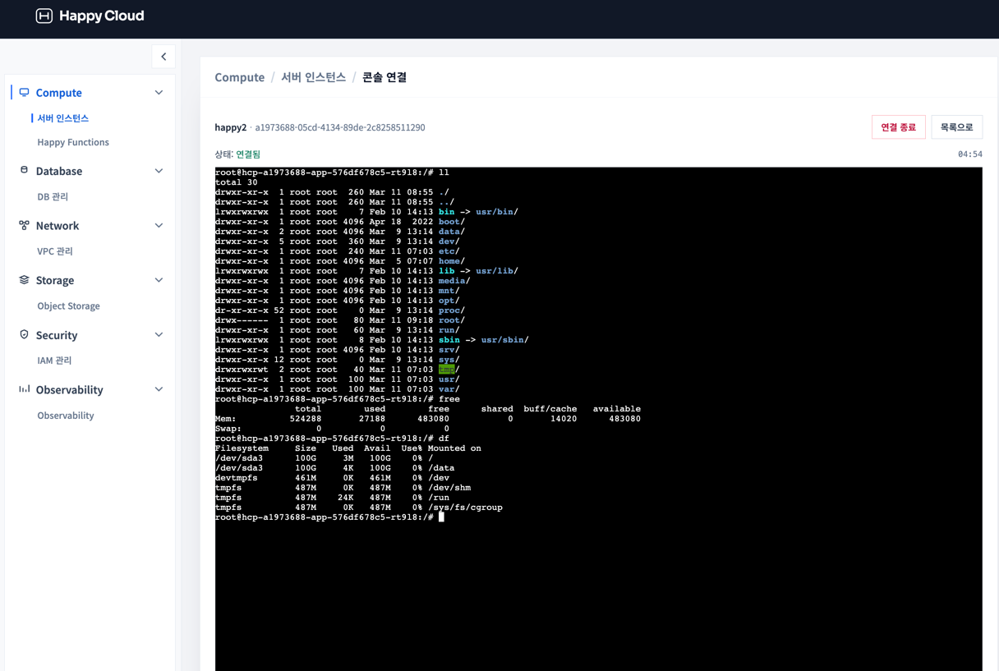


### Build

```
docker build -t hcp-user-service:v1.0.0 -f user-service/Dockerfile .
docker build -t hcp-compute-service:v1.0.0 -f compute-service/Dockerfile .
docker build -t hcp-orchestrator-worker:v1.0.0 -f orchestrator-worker/Dockerfile .
docker build -t hcp-api-gateway:v1.0.0 -f hcp-api-gateway/Dockerfile .
```


### Local Environment

* env 설정

```
# env.template 작성 후
$ cp env.template .env.local
```

* 관련 도구 실행

```
$ docker compose up -d
```

* kafka topic 생성

```
/opt/kafka/bin/kafka-topics.sh \
  --bootstrap-server kafka:9092 \
  --create \
  --if-not-exists \
  --topic hcp.compute.instance.provisioning \
  --partitions 3 \
  --replication-factor 1;
  
/opt/kafka/bin/kafka-topics.sh \
  --bootstrap-server kafka:9092 \
  --create \
  --if-not-exists \
  --topic hcp.compute.instance.provisioning.DLT \
  --partitions 3 \
  --replication-factor 1;
  
/opt/kafka/bin/kafka-topics.sh \
  --bootstrap-server kafka:9092 \
  --create \
  --if-not-exists \
  --topic hcp.compute.instance.status \
  --partitions 3 \
  --replication-factor 1;
  
/opt/kafka/bin/kafka-topics.sh \
  --bootstrap-server kafka:9092 \
  --create \
  --if-not-exists \
  --topic hcp.compute.instance.update.lifecycle \
  --partitions 3 \
  --replication-factor 1;
  
/opt/kafka/bin/kafka-topics.sh \
  --bootstrap-server kafka:9092 \
  --create \
  --if-not-exists \
  --topic hcp.compute.instance.scaling \
  --partitions 3 \
  --replication-factor 1;
  
/opt/kafka/bin/kafka-topics.sh \
  --bootstrap-server kafka:9092 \
  --create \
  --if-not-exists \
  --topic hcp.compute.instance.register.sshkey \
  --partitions 3 \
  --replication-factor 1;
  
/opt/kafka/bin/kafka-topics.sh \
  --bootstrap-server kafka:9092 \
  --create \
  --if-not-exists \
  --topic hcp.compute.instance.update.networkpolicy \
  --partitions 3 \
  --replication-factor 1;
  
```

* DB SQL 초기화

```
각 서비스 sql/init.sql 실행
```

* k8s 셋팅

minikube 실행 (Mac 에서만)

```
minikube start \
  --container-runtime=containerd \
  --cpus=4 \
  --memory=8192 \
  --cni=calico
minikube addons enable gvisor
minikube addons enable metallb
minikube tunnel
```

CNI 적용 (calico) - Minikube 에서는 안해도 됨

```
kubectl apply -f calico.yaml
```

22번 포트 기본 허용 제외

```
kubectl apply -f felixconfiguration.yaml
```

ubuntu 이미지 load

```
docker build -t hcp_ubuntu:v1.0.0 . -f hcp_ubuntu.Dockerfile
minikube image load hcp_ubuntu:v1.0.0
```

rocky 이미지 load

```
docker build -t hcp_rocky:v1.0.0 . -f hcp_rocky.Dockerfile
minikube image load hcp_rocky:v1.0.0
```

StorageClass

```
kubectl apply -f loopfs.yaml
kubectl apply -f compute-server-v1.yaml
```

* 각 서비스 실행

```
# 예시
$ java -jar user-service.jar --spring.profiles.active=local
```